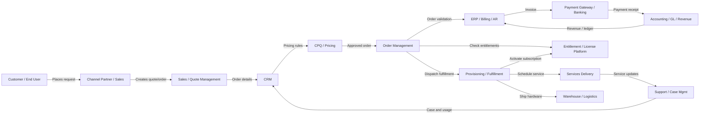

# Order-to-Cash C4 Diagram

```mermaid
flowchart LR
    Customer[Customer / End User]
    Partner[Channel Partner / Sales]
    Sales[Sales / Quote Management]
    CRM[CRM]
    CPQ[CPQ / Pricing]
    ERP[ERP / Billing / AR]
    OMS[Order Management]
    Entitlement[Entitlement / License Platform]
    Provisioning[Provisioning / Fulfillment]
    Services[Services Delivery]
    Warehouse[Warehouse / Logistics]
    Payment[Payment Gateway / Banking]
    Accounting[Accounting / GL / Revenue]
    Support[Support / Case Mgmt]

    Customer -->|Places request| Partner
    Partner -->|Creates quote/order| Sales
    Sales -->|Order details| CRM
    CRM -->|Pricing rules| CPQ
    CPQ -->|Approved order| OMS
    OMS -->|Order validation| ERP
    OMS -->|Check entitlements| Entitlement
    OMS -->|Dispatch fulfillment| Provisioning
    Provisioning -->|Activate subscription| Entitlement
    Provisioning -->|Schedule service| Services
    Provisioning -->|Ship hardware| Warehouse
    ERP -->|Invoice| Payment
    Payment -->|Payment receipt| Accounting
    Accounting -->|Revenue / ledger| ERP
    Services -->|Service updates| Support
    Support -->|Case and usage| CRM
```

Open this file in VS Code and choose `Markdown: Open Preview` or `Markdown: Open Preview to the Side` to render the Mermaid diagram.
