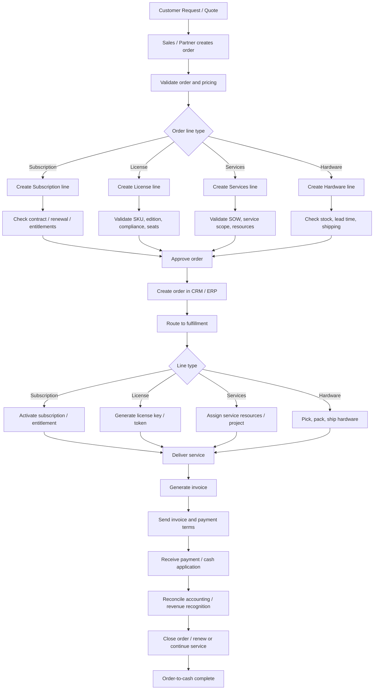
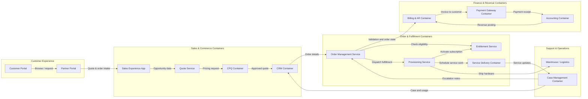

# Cisco IT Order-to-Cash Mermaid Preview

## 1) Consolidated order-to-cash flow

## 2) Container diagram (C4)

## 3) Enterprise architecture view

```mermaid
flowchart LR
    subgraph CustomerLayer[Customer & Sales]
        C[Customer]
        P[Partner / Sales Rep]
        Q[Quote / Opportunity]
    end

    subgraph CorePlatform[Core Order Platform]
        CRM[CRM]
        CPQ[CPQ / Pricing]
        OM[Order Management]
        E[Entitlement / Contracts]
    end

    subgraph Fulfillment[Fulfillment & Delivery]
        PR[Provisioning Engine]
        SUB[Subscription Activation]
        LIC[License Key Generator]
        SVC[Service Delivery / PMO]
        WH[Warehouse / Logistics]
    end

    subgraph Finance[Finance & Billing]
        ERP[ERP / Billing]
        INV[Invoice Engine]
        AR[AR / Cash Application]
        GL[GL / Revenue Recognition]
    end

    subgraph External[External Systems]
        PAY[Payment Gateway]
        BANK[Bank / Treasury]
        TAX[Tax / Compliance]
    end

    C -->|Request| P
    P -->|Quote and order| Q
    Q -->|Opportunity data| CRM
    CRM -->|Price & validate| CPQ
    CPQ -->|Approved order| OM
    OM -->|Contract checks| E
    OM -->|Dispatch line fulfillment| PR

    PR -->|Subscription line| SUB
    PR -->|License line| LIC
    PR -->|Services line| SVC
    PR -->|Hardware line| WH

    SUB -->|Activation status| ERP
    LIC -->|License activation| ERP
    SVC -->|Service milestones| ERP
    WH -->|Shipment / receipt| ERP

    ERP -->|Creates invoice| INV
    INV -->|Send invoice| PAY
    PAY -->|Payment receipt| AR
    AR -->|Cash application| GL
    GL -->|Reporting / compliance| ERP

    ERP -->|Tax / statutory| TAX
    AR -->|Settlement| BANK
```

## Open preview in VS Code

1. Open this file in VS Code.
2. Press Ctrl+Shift+P.
3. Run: `Markdown: Open Preview` or `Markdown: Open Preview to the Side`.

The Mermaid diagrams will render in the preview panel.
